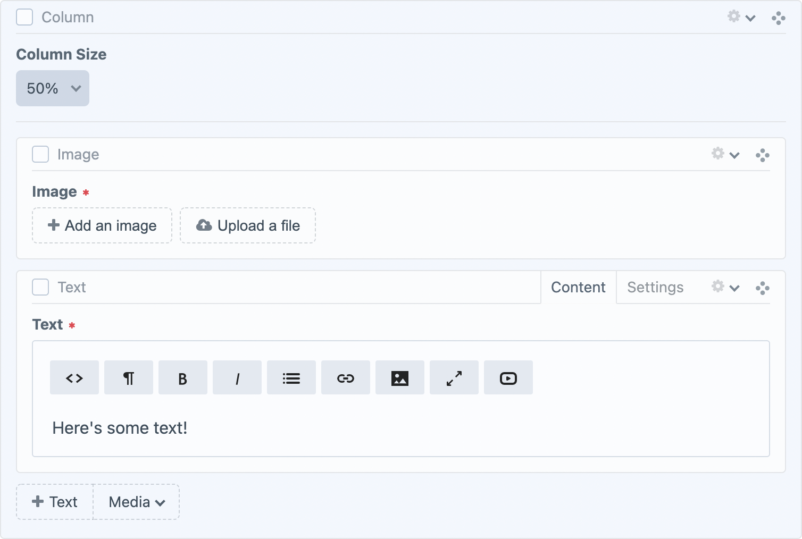

# Neo
#### A Matrix-like field type with block hierarchy

Neo is a [Craft CMS](https://craftcms.com) field type that builds upon the concept of the [Matrix field type](https://craftcms.com/features/matrix) with a number of very useful features. Neo has been carefully crafted (pun intended) to ensure it matches the look and feel of Craft.

 

### Allow blocks to contain children

Let block types have the ability to contain child block types. You can filter what blocks are allowed within others, as well as set whether a block type can only be a child of another.

 

### Group block buttons

Sometimes you end up with many block types. Adding groups allows you to organise your block types into drop down menus.

 

### Set minimum and maximum blocks by type

Neo has the ability to set minimum and maximum counts on individual block types, either throughout a Neo field, or under one parent block or at the top level.

### Copy, paste and clone blocks

A copied block can be pasted anywhere within its Neo field that allows that block type to exist, including on a different entry. Blocks are copied and pasted with their descendants.

## Documentation

- [Installation](docs/installation.md)
- [Creating Neo Fields](docs/creating-neo-fields.md)
- [Templating](docs/templating.md)
- [Eager Loading](docs/eager-loading.md)
- [GraphQL](docs/graphql.md)
- [Resources](docs/resources.md)
- [API](docs/api.md)
- [Events](docs/events.md)
- [Settings](docs/settings.md)
- [Console Commands](docs/console-commands.md)
- [Plugin Compatibility](docs/plugin-compatibility.md)
- [Feed Me](docs/feed-me.md)
- [FAQ](docs/faq.md)
- Content Migration Guides:
    - [Populating Neo Fields](docs/content-migration-guides/populating-neo-fields.md)
    - [Updating, Duplicating and Creating Block Types](docs/content-migration-guides/updating-duplicating-creating-block-types.md)
- Upgrade Guides:
    - [Upgrading to Neo 2.7 and Craft 3.4](docs/upgrade-guides/neo-2.7-craft-3.4.md)
    - [Upgrading to Neo 4](docs/upgrade-guides/neo-4.md)
- [Changelog](CHANGELOG.md)

---

*Created by [Benjamin Fleming](https://github.com/benjamminf)*
 
*Maintained by [Spicy Web](https://spicyweb.com.au)*
