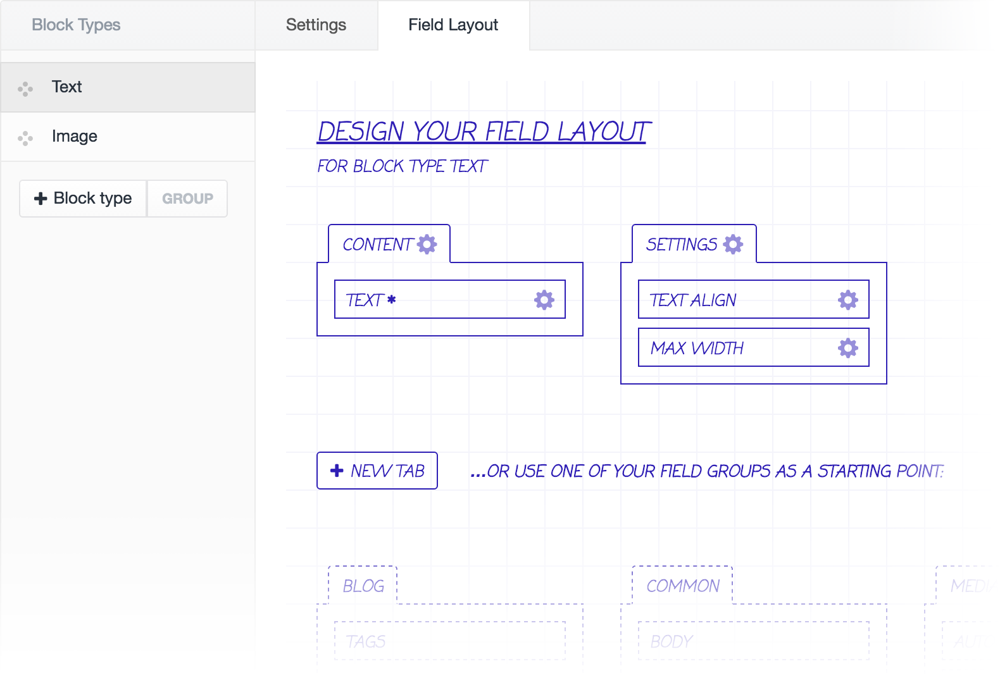
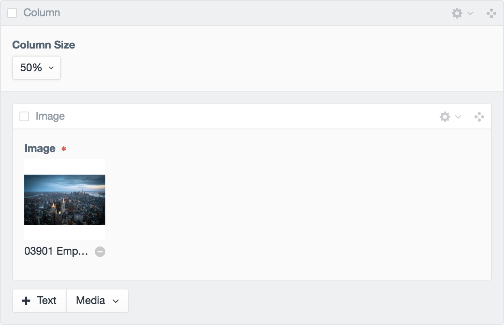

# &nbsp; Neo
#### A Matrix-like field type that uses existing fields

Neo is a [Craft CMS](https://craftcms.com) field type that builds upon the concept of the [Matrix field type](https://craftcms.com/features/matrix) with a number of very useful features. Neo has been carefully crafted (pun intended) to ensure it matches the look and feel of Craft.

 

### Use existing fields
In contrast to the Matrix field, block types are built using existing fields.

 

### Organise blocks with tabs
Sometimes block types require having a lot of fields. Using the field layout designer, you can organise fields into tabs, much like when creating entry types.

 

### Group block buttons
And sometimes you end up with many block types. Adding groups allows you to organise your block types into drop down menus.

 

### Set maximum blocks by type
Neo has the ability to set a maximum count on individual block types.

 

### Allow blocks to contain children
Let block types have the ability to contain child block types. You can filter what blocks are allowed within others, as well as set whether a block type can only be a child of another.

 

### Supports the following plugins

#### [Quick Field](https://github.com/benjamminf/craft-quick-field)
Supports the ability to create fields when building field layouts for block types.

#### [Reasons](https://github.com/mmikkel/Reasons-Craft)
Supports the ability to set field conditionals on block types.

#### [Relabel](https://github.com/benjamminf/craft-relabel)
Supports the ability to relabel fields on block types.

 

---

### [Refer to the Wiki](https://github.com/benjamminf/craft-neo/wiki) for documentation on how to use Neo.
