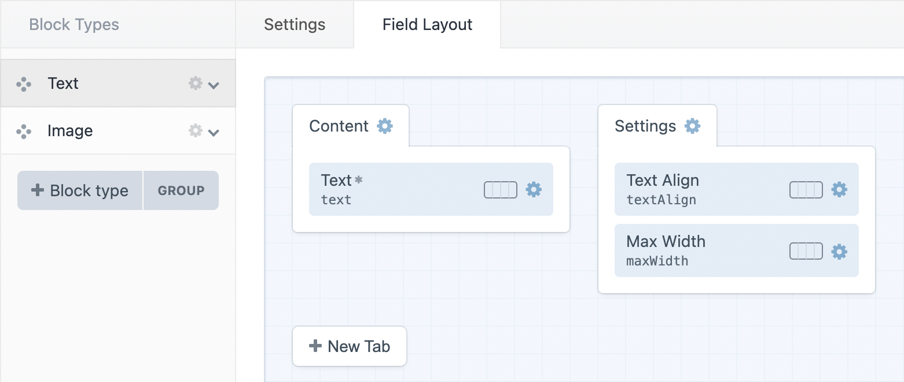
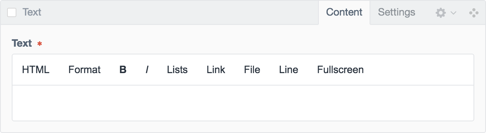
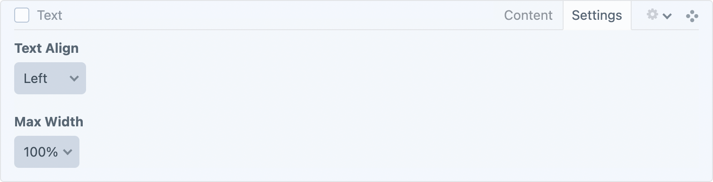
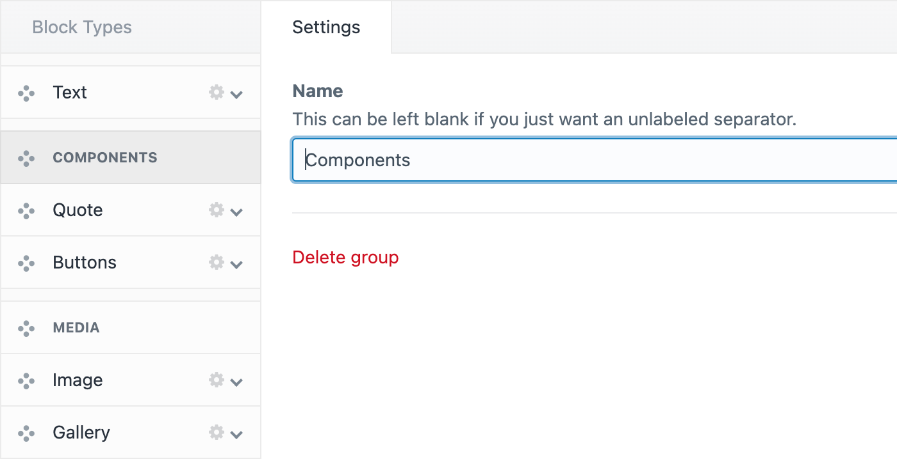
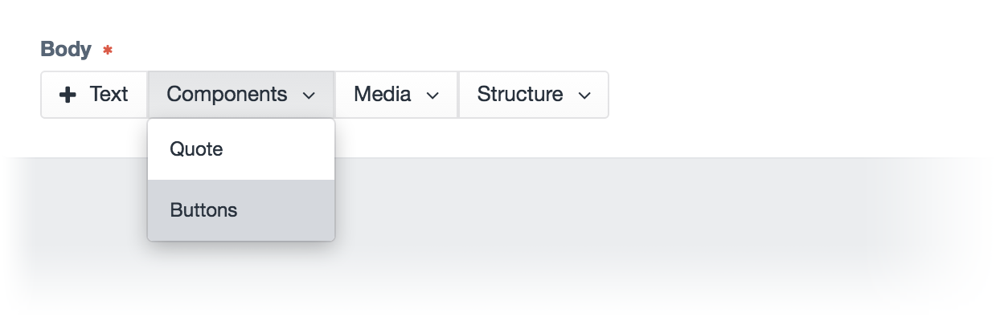
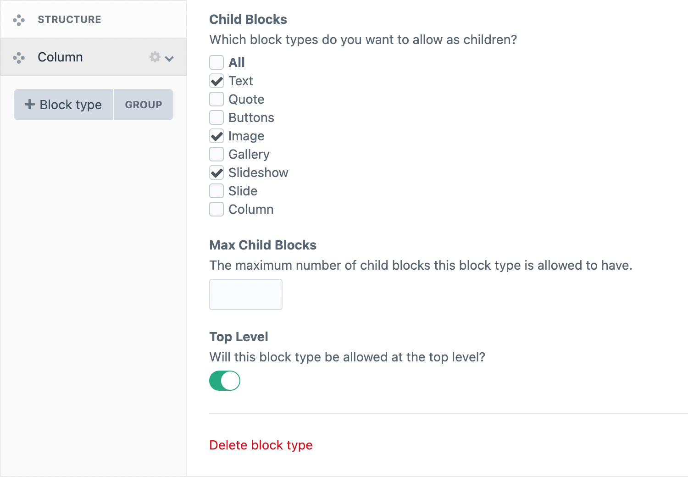
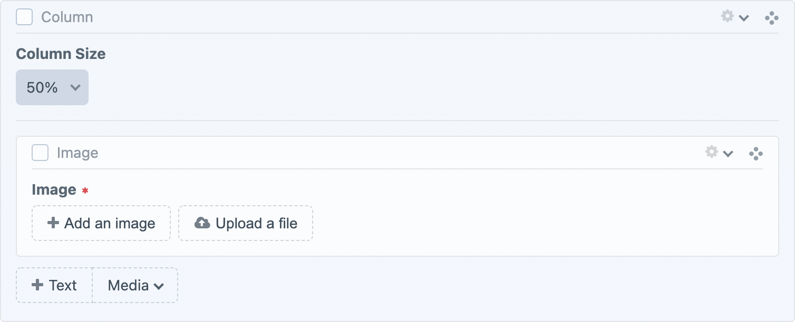
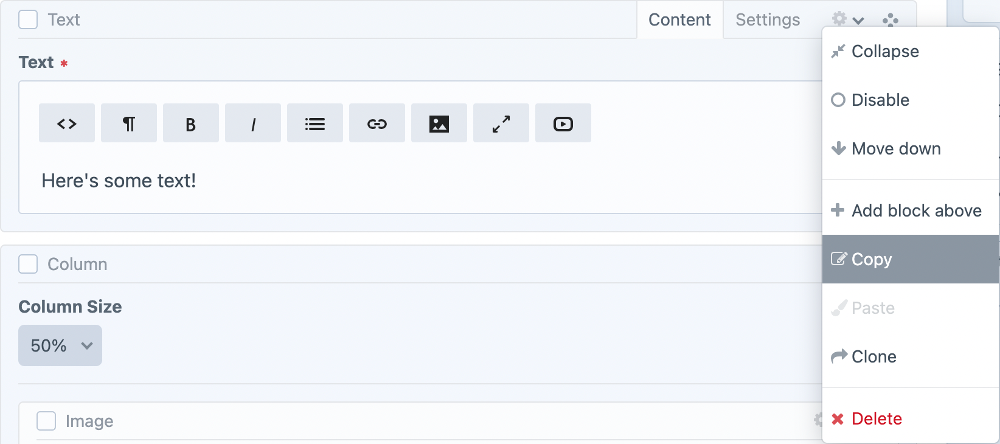
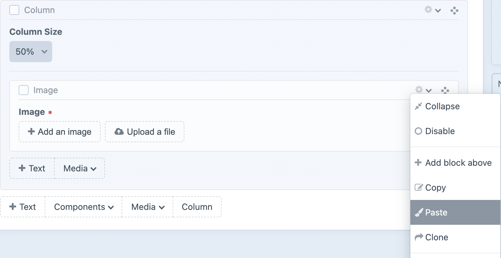

# Neo
#### A Matrix-like field type that uses existing fields

Neo is a [Craft CMS](https://craftcms.com) field type that builds upon the concept of the [Matrix field type](https://craftcms.com/features/matrix) with a number of very useful features. Neo has been carefully crafted (pun intended) to ensure it matches the look and feel of Craft.

 

### Use existing fields
In contrast to the Matrix field, block types are built using existing fields.

 

### Organise blocks with tabs
Sometimes block types require having a lot of fields. Using the field layout designer, you can organise fields into tabs, much like when creating entry types.

 

### Group block buttons
And sometimes you end up with many block types. Adding groups allows you to organise your block types into drop down menus.

 

### Set maximum blocks by type
Neo has the ability to set a maximum count on individual block types.

 

### Allow blocks to contain children
Let block types have the ability to contain child block types. You can filter what blocks are allowed within others, as well as set whether a block type can only be a child of another.

### Copy/Paste Blocks
A copied block can be pasted anywhere within its field that allows that particular block type to exist. 
Neo copies/pastes a block with descendants, all descendant blocks are copied and pasted with the ancestor block.

## Documentation
- [Installation](docs/installation.md)
- [Creating Neo Fields](docs/creating-neo-fields.md)
- [Templating](docs/templating.md)
- [Eager Loading](docs/eager-loading.md)
- [GraphQL](docs/graphql.md)
- [Resources](docs/resources.md)
- [API](docs/api.md)
- [Plugin Compatibility](docs/plugin-compatibility.md)
- [FAQ](docs/faq.md)
- [Content Migration Guide: Updating, Duplicating and Creating Block Types](docs/content-migration-guides/updating-duplicating-creating-block-types.md)
- [Changelog](CHANGELOG.md)

---

*Created by [Benjamin Fleming](https://github.com/benjamminf)*
 
*Maintained by [Spicy Web](https://spicyweb.com.au)*
