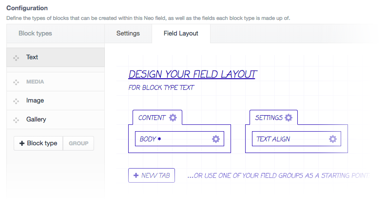

# Neo
#### Exit the Matrix with the one true Craft field type

Neo is a [Craft CMS](https://craftcms.com) field type that builds upon the concept of the [Matrix field type](https://craftcms.com/features/matrix) with a bunch of cool new features. Neo is built from the ground up, and in the classic style of Craft, so as to feel like it's native to the core product.

## Features

- **Use existing fields for your block types**
- Add tabbed field sections on your block types
- Create block type groups for a cleaner UI
- Set a maximum count for individual block types
- **Create heirarchy by allowing blocks types to nest other specific block types**
- **Full support for [Reasons](https://github.com/mmikkel/Reasons-Craft), [Relabel](https://github.com/benjamminf/craft-relabel) and [Quick Field](https://github.com/benjamminf/craft-quick-field) plugins**

## Release

During the release of `0.x` versions, breaking changes are to be expected without migration. Do not use in production until version `1.0` is released.

### Feature checklist

- [x] ~~Using existing fields~~
- [x] ~~Tabbed field sections~~
- [x] ~~Block type groups~~
- [x] ~~Block type max count~~
- [x] ~~Block hierarchy~~
- [x] ~~Reasons support~~
- [x] ~~Relabel support~~
- [x] ~~Quick Field support~~

### Version `1.0` ETA

Version `1.0` will release with all features around the end of April 2016. In the meantime, `0.x` versions will be released with partial feature support.
