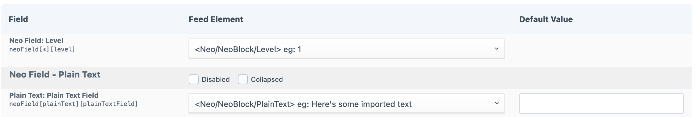

# Feed Me

Neo versions 3.5.0 and later include support for the [Feed Me](https://plugins.craftcms.com/feed-me) plugin.

Feed Me support in Neo works in largely the same way as [importing into Matrix fields in Craft 4](https://docs.craftcms.com/feed-me/v4/guides/importing-into-matrix.html), with the exception that Neo blocks can have their level set. To adapt the second example from the [Note on structure](https://docs.craftcms.com/feed-me/v4/guides/importing-into-matrix.html#note-on-structure) section of the Matrix import guide, setting the block levels in the data to be imported would look something like this:

XML:

```xml
<NeoContent>
    <NeoBlock>
        <Copy>Lorem ipsum...</Copy>
        <Caption>Some more text.</Caption>
        <Level>1</Level>
    </NeoBlock>

    <NeoBlock>
        <Image>img_fjords.jpg</Image>
        <Level>2</Level>
    </NeoBlock>
</NeoContent>
```

JSON:

```json
{
    "NeoBlock": [
        {
            "Copy": "Lorem ipsum...",
            "Caption": "Some more text.",
            "Level": 1
        },
        {
            "Image": "img_fjords.jpg",
            "Level": 2
        }
    ]
}
```

The name used for the level property must be consistent across blocks in the same Neo field, and there is a single row in the feed settings to set the feed element for block levels:



A field for the default value of block levels is not provided, as Neo internally considers the default level to be 1.
